# Inspire

Official implementation of the paper "[InSpire: Vision-Language-Action Models with Intrinsic Spatial Reasoning](https://arxiv.org/abs/2505.13888)".

> **Note**: We are doing our best to improve this work. If you have any questions or suggestions, please feel free to create an issue in this repo or contact us at shihan.wu.koorye@outlook.com.

[[Project]](https://Koorye.github.io/proj/Inspire/) [[ArXiv]](https://arxiv.org/abs/2505.13888) [[PDF]](https://arxiv.org/pdf/2505.13888) [[Inspire-FAST]](https://github.com/Koorye/Inspire-FAST)

## News

- 🔥**May 23, 2025**: Our paper has been updated for better clarity and readability. The optimized version is now available on arXiv.
- 🔥**May 21, 2025**: The code is released and the paper is now available on arXiv.

## Introduction

> **Abstract** Leveraging pretrained Vision-Language Models (VLMs) to map language instruction and visual observations to raw low-level actions, Vision-Language-Action models (VLAs) hold great promise for achieving general-purpose robotic systems. Despite their advancements, existing VLAs tend to spuriously correlate task-irrelevant visual features with actions, limiting their generalization capacity beyond the training data. To address this challenge, we propose \textbf{Intrinsic Spatial Reasoning (InSpire)}, which mitigates the adverse effects of spurious correlations by boosting the spatial reasoning ability of VLAs. Specifically, InSpire redirects the model's attention to task-relevant visual clues by simply appending the question *“In which direction is the [object] relative to the robot”* before the language instruction and aligning the VLA's answer *“right / left / up / down / front / back / grasp”* and predicted actions with the ground-truth. Notably, InSpire can be employed as a plugin to enhance existing autoregressive VLAs, requiring no extra data or interaction with other large models. Extensive experimental results in both simulation and real-world environments demonstrate the effectiveness and flexibility of our approach.

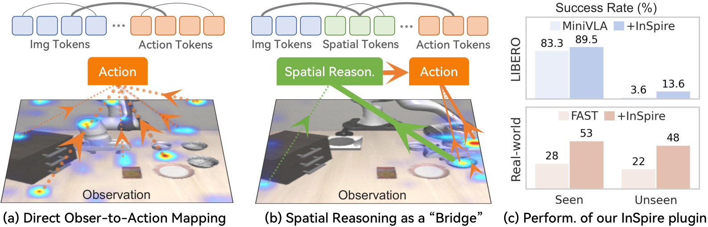
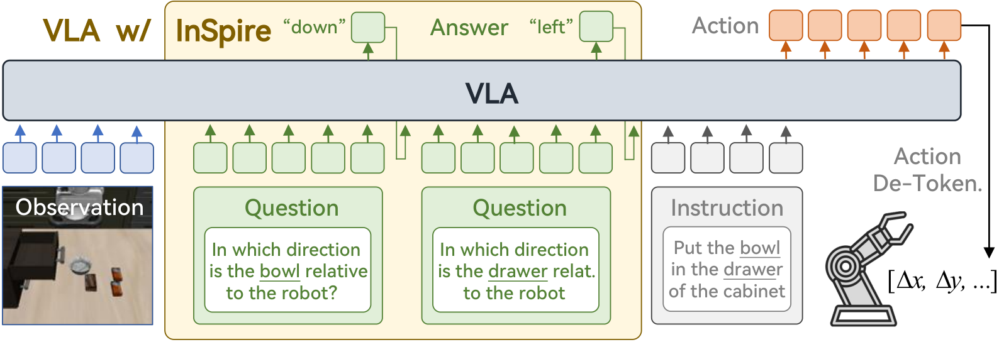

## Experiments

### Overall Performance

**Simulatied Environments**

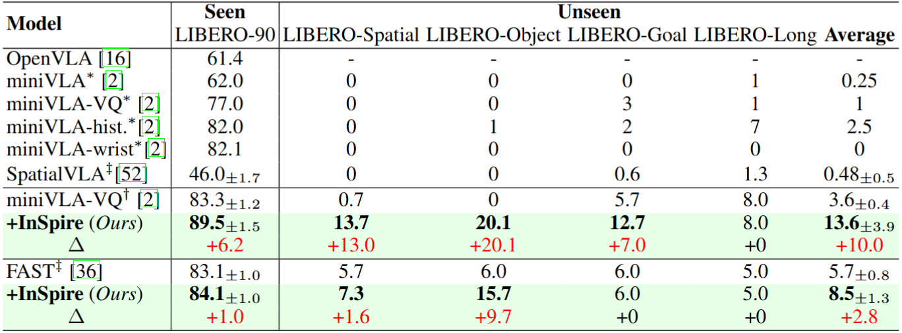

**Real-world Environments**

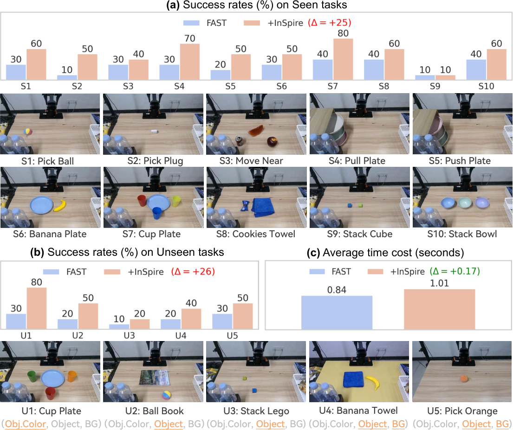

## Videos

### Simulated Environments

**MiniVLA**

| Libero-90<br>Butter Drawer | Libero-90<br>Moka Stove | Libero-90<br>Sauce Tray | Libero-90<br>Book Caddy |
|----------------------------|-------------------------|-------------------------|-------------------------|
| 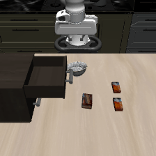 |  |  | 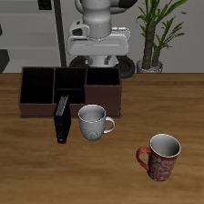 |

| Libero-Goal<br>Bowl Plate | Libero-Object<br>Cheese Basket | Libero-Spatial<br>Bowl Plate | Libero-10<br>Book Caddy |
|----------------------------|------------------------------|---------------------------|-------------------------|
| 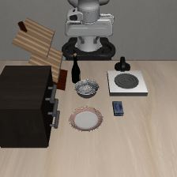 | 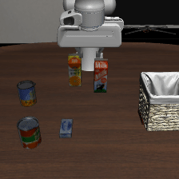 | 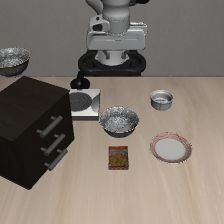 | 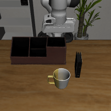 |

**InspireVLA (Ours)**

| Libero-90<br>Butter Drawer | Libero-90<br>Moka Stove | Libero-90<br>Sauce Tray | Libero-90<br>Book Caddy |
|----------------------------|-------------------------|-------------------------|-------------------------|
| 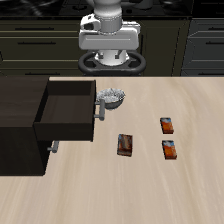 | 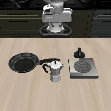 | 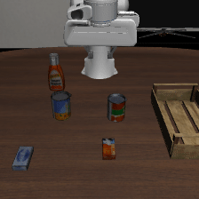 | 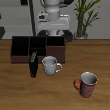 |

| Libero-Goal<br>Bowl Plate | Libero-Object<br>Cheese Basket | Libero-Spatial<br>Bowl Plate | Libero-10<br>Book Caddy |
|----------------------------|------------------------------|---------------------------|-------------------------|
|  | 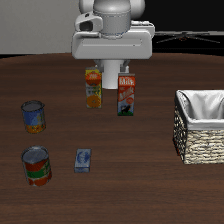 |  | 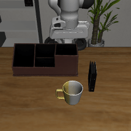 |

### Real-world Environments

**FAST**

| Seen<br>Cookies Towel | Seen<br>Left Bowl on Middle Bowl | Seen<br>Blue Cup Plate | Seen<br>Pull Bottom Plate |
|------------------------|---------------------------------|------------------------|--------------------------|
|  |  |  |  |

| Unseen<br> Pick Orange | Unseen<br>Banana Towel | Unseen<br>Ball Book | Unseen<br>Orange Cup Plate |
|------------------------|------------------------|-----------------------|--------------------------|
| 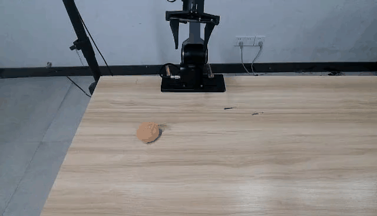 |  |  |  |

**InspireVLA (Ours)**

| Seen<br>Cookies Towel | Seen<br>Left Bowl on Middle Bowl | Seen<br>Blue Cup Plate | Seen<br>Pull Bottom Plate |
|------------------------|---------------------------------|------------------------|--------------------------|
|  |  |  |  |

| Unseen<br> Pick Orange | Unseen<br>Banana Towel | Unseen<br>Ball Book | Unseen<br>Orange Cup Plate |
|------------------------|------------------------|-----------------------|--------------------------|
|  |  |  |  |

## Models Checkpoints

| Model | Dataset | Checkpoint |
|-------|---------|------------|
| MiniVLA | Libero90 | [Download]() |
| InspireVLA | Libero90 | [Download]() |
| InspireVLA | Libero10+Goal+Object+Spatial | [Download]() |

## Installation

1. Clone the repository.

```bash
git clone https://github.com/Koorye/Inspire.git
```

2. Install the dependencies.

```bash
conda create -n inspire python=3.10
conda activate inspire

pip install torch==2.3.1 torchvision==0.18.1 torchaudio==2.3.1 --index-url https://download.pytorch.org/whl/cu118
pip install -r requirements-min.txt

pip install packaging ninja
ninja --version; echo $?  # Verify Ninja --> should return exit code "0"
pip install "flash-attn==2.5.5" --no-build-isolation
```

## Evaluation with Pretrained Checkpoints

1. Download pretrained checkpoints.

TODO

2. Run the evaluation script.

```bash
bash vla_scripts/eval/eval_baseline_libero90.sh
bash vla_scripts/eval/eval_inspire_libero90.sh
```

## Training Your Own Checkpoints

1. Prepare the dataset.

See [Dataset Preparation](DATASET.md).

2. Run the training script.

```bash
bash vla_scripts/train/train_baseline_libero90.sh
bash vla_scripts/train/train_inspire_libero90.sh
```

3. Run the evaluation script.

```bash
bash vla_scripts/eval/eval_baseline_libero90.sh
bash vla_scripts/eval/eval_inspire_libero90.sh
```

## Acknowledgements

Our work is built upon the following open-source projects: [LIBERO](https://github.com/Lifelong-Robot-Learning/LIBERO), [MiniVLA](https://github.com/Stanford-ILIAD/openvla-mini), [Pi-0](https://github.com/Physical-Intelligence/openpi). We thank the authors for releasing their code. If you use our model and code, please consider citing these works as well.